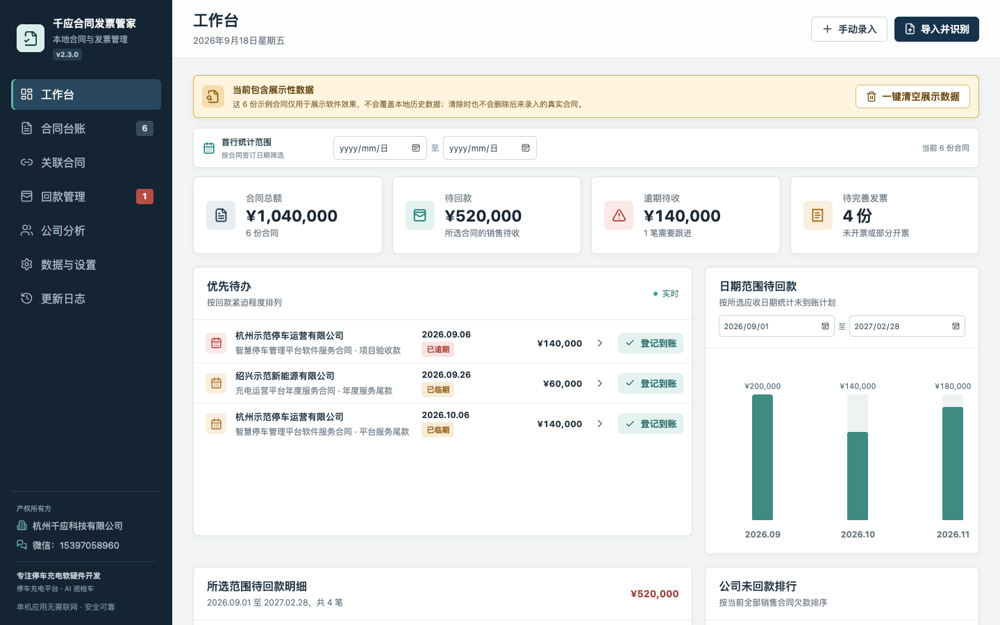
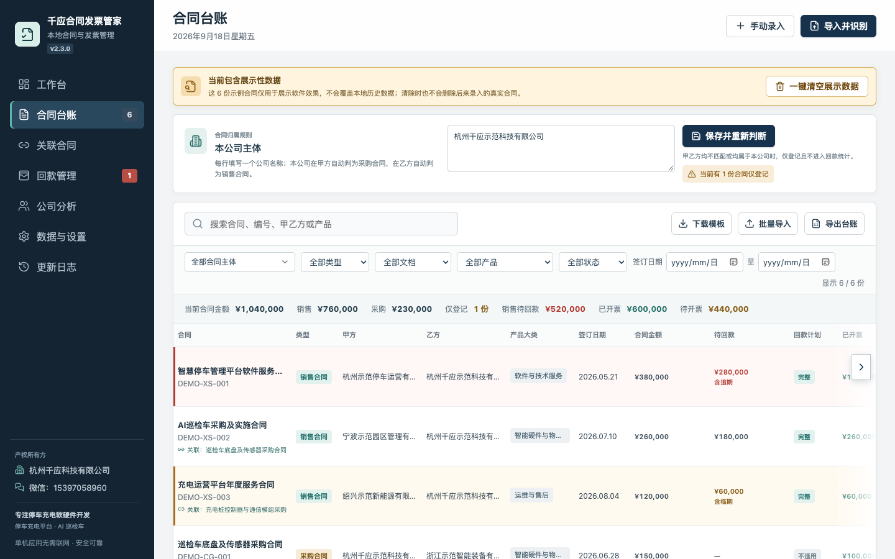
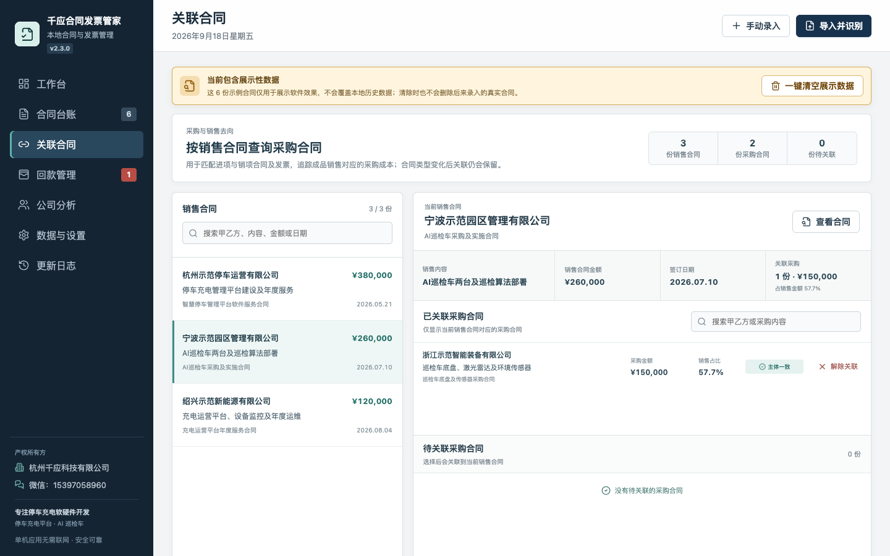
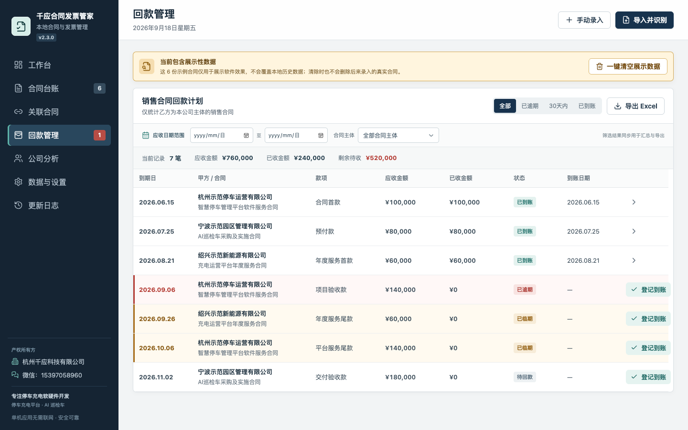
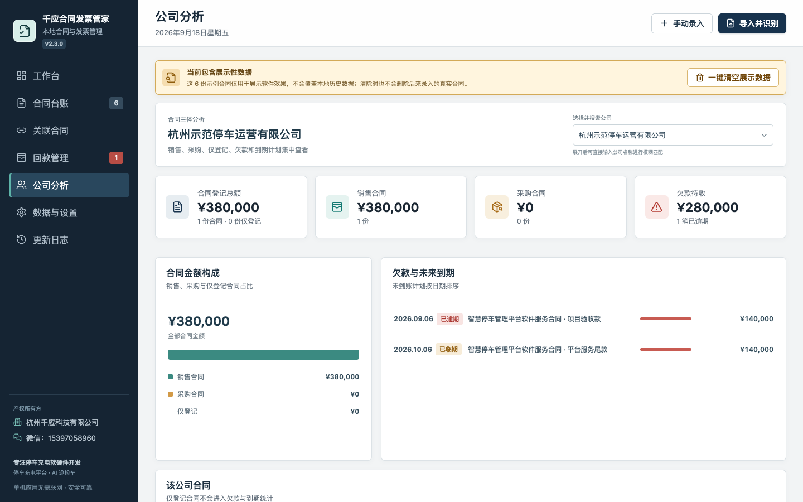
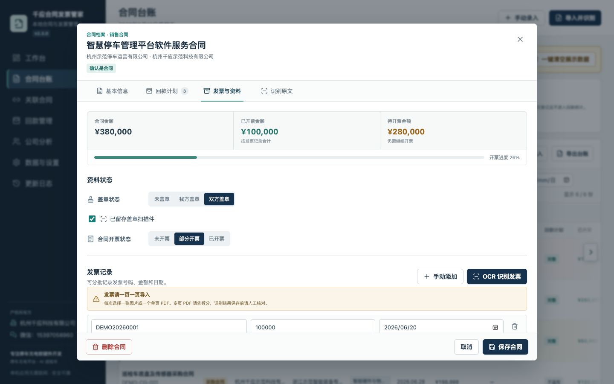
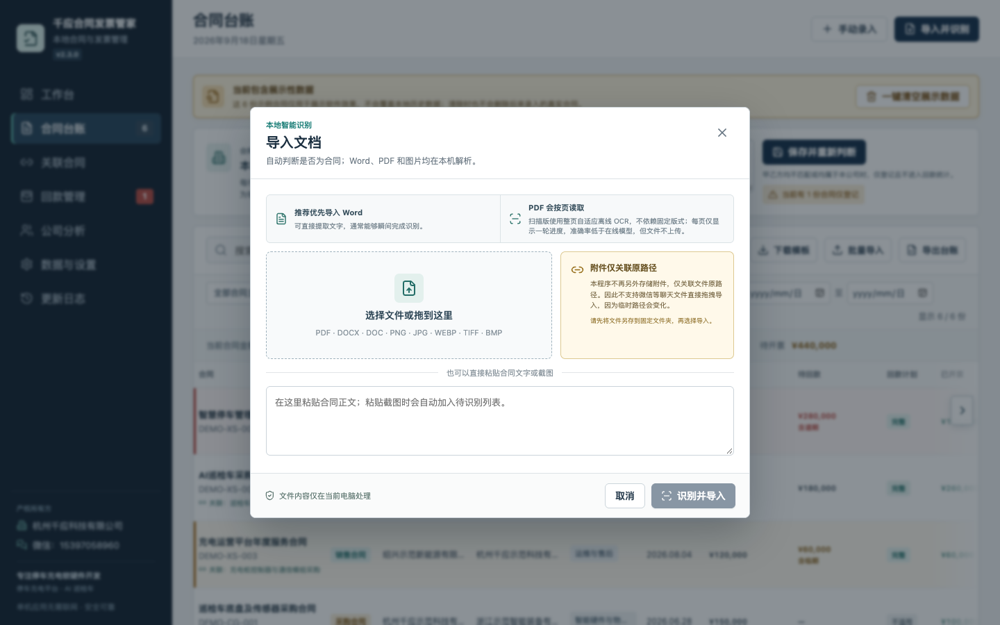

# 千应合同发票管家

**v2.3.0 · 本地合同与发票管理 · Mac Apple 芯片 / Windows 64 位**  
产权所有方：杭州千应科技有限公司｜微信：15397058960

面向需要同时管理销售合同、采购合同、发票和回款的小团队。合同业务数据保存在当前电脑，文档识别在本地离线完成；可以按公司、日期和产品查找合同，跟踪每笔应收款、发票及盖章资料，并把采购成本关联到对应销售合同。

## 主要功能

### 合同导入与识别

- 支持 Word（DOCX、DOC）、PDF、图片（PNG、JPG、WEBP、TIFF、BMP）以及粘贴合同文字；也可下载 Excel 模板批量录入。
- Word 文本通常可直接提取；扫描版 PDF 和图片使用本地离线 OCR，不上传合同内容。扫描质量会影响准确率，导入后应核对识别结果。
- 自动判断文件是否为合同，并提取甲方、乙方、合同金额、日期、产品等信息。金额和关键日期可查看识别候选，选取或手动修正。
- **附件仅关联原文件路径，不另存一份。** 微信等聊天临时文件请先另存到固定文件夹，再导入程序。

### 合同台账与多公司主体

- 在合同台账设置一个或多个本公司名称。根据本公司处于甲方还是乙方，自动区分采购合同和销售合同；双方都不是本公司的合同标为“仅登记”，不计入回款统计。
- 可按合同主体、类型、产品大类、签订日期、状态和关键词筛选；汇总当前筛选范围的合同额、待回款、已开票和待开票金额。
- 用文字和颜色展示回款计划、发票、盖章及扫描件状态，支持备注、重复编号提醒；导出 Excel 时与当前页面筛选结果保持一致。

### 回款与发票

- 按合同录入分期应收、已到账金额和到账日期。回款计划和已收合计不得超过合同金额。
- 默认提前 30 天以黄色提示临期，逾期标红；工作台展示优先待办、按月待回款明细和公司欠款排行。
- 回款管理支持日期范围、合同主体及状态筛选，汇总应收、已收、剩余金额，并导出当前结果为 Excel。
- 记录发票号码、金额、日期、甲方和乙方对应主体；可逐页导入发票做离线 OCR，并提示发票主体与合同不一致的情况。发票金额合计不得超过合同金额；另可记录双方盖章和扫描件留存状态。

### 采购关联、公司分析与数据安全

- 选择一份销售合同，即可查看对应采购合同、采购内容、金额及占销售额比例；变更本公司名称时保留已有关系，并提示主体匹配情况。
- 公司分析可模糊搜索公司，查看合同总额、销售/采购构成、欠款及未来到期款项；金额显示完整数字，最多保留两位小数。
- 完全单机使用，无需联网；每隔 3 天自动备份一次，仅保留最近两份，也支持手动导出和恢复完整数据。
- 首次安装且没有历史数据时展示六份**示例合同**，醒目提示并可一键清空，不会替换或清除真实合同。

## 页面预览

以下截图均使用程序生成的**展示性数据**，公司名称、合同编号、金额及发票号均为示例，不代表真实业务记录。

### 工作台

日期范围可调；集中查看合同总额、待回款、逾期、发票待办、月度计划和公司欠款排行。

### 合同台账

设置本公司主体后自动判断销售、采购或仅登记；按多条件筛选并汇总当前结果，右侧还有发票和资料状态列。

### 关联合同

选定销售合同，查看关联采购、采购金额及销售占比，便于对应进项与销项。

### 回款管理

分期查看应收和已收，黄色提示临期、红色提示逾期；可按日期和主体筛选并导出 Excel。

### 公司分析

按公司查询销售、采购、欠款和到期日，金额均显示完整数字。

### 发票与资料

查看开票进度、发票记录、盖章与扫描件状态；发票支持手工填写和逐页 OCR 识别。

### 导入并识别

选择文件、拖入文件或粘贴文字；Word 识别更快，扫描 PDF 和图片使用离线 OCR，并保留人工核对入口。

## 下载与安装

到 [v2.3.0 发布页](https://github.com/qianyu-126/qianying-contract-invoice-manager/releases/tag/v2.3.0) 选择安装包：

- Mac Apple 芯片：`QianYing-Contract-Invoice-Manager-2.3.0-Mac-AppleSilicon.dmg`
- Windows 64 位：`QianYing-Contract-Invoice-Manager-2.3.0-Windows-x64.exe`

**设备解锁密码：千应停车充电。** 首次导入合同或手工录入时输入，同一设备只需输入一次；浏览已有页面无需解锁。

升级前建议在“数据与设置”中手动导出备份。覆盖安装不会主动清除本地业务数据，附件仍依赖原文件路径。

### 安装包校验（SHA-256）

- Mac DMG：`b14587023d71aefbd327ecd3100dd0b429a62fe16f235e36b90d383e6be0591a`
- Windows EXE：`56e3dbee41cac83741be225c4b8b95634a4113e3cf069f6355f32fa60111affa`

本公开仓库仅发布安装包、截图和说明。GitHub 自动提供的“Source code”压缩包只包含本公开仓库内容，**不是应用程序源码**。
